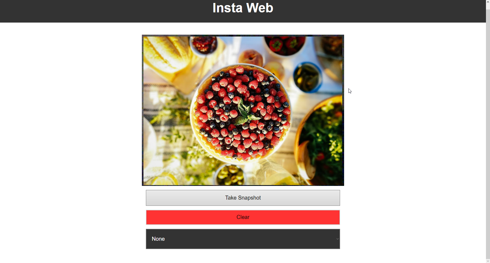

# Insta Web

## Table of Contents <!-- omit in toc -->

- [Insta Web](#insta-web)
  - [Introduction](#introduction)
  - [Features](#features)
  - [Screenshots](#screenshots)

Demo: <https://insta-web-filters.herokuapp.com/>

## Introduction

It's a sample application to apply filters in Web using vanilla HTML5 and JavaScript.

## Features

- Take picture.
- List of all taken pictures (Current session only).
- Apply filters from dropdown.
- Clear all images.

## Screenshots

